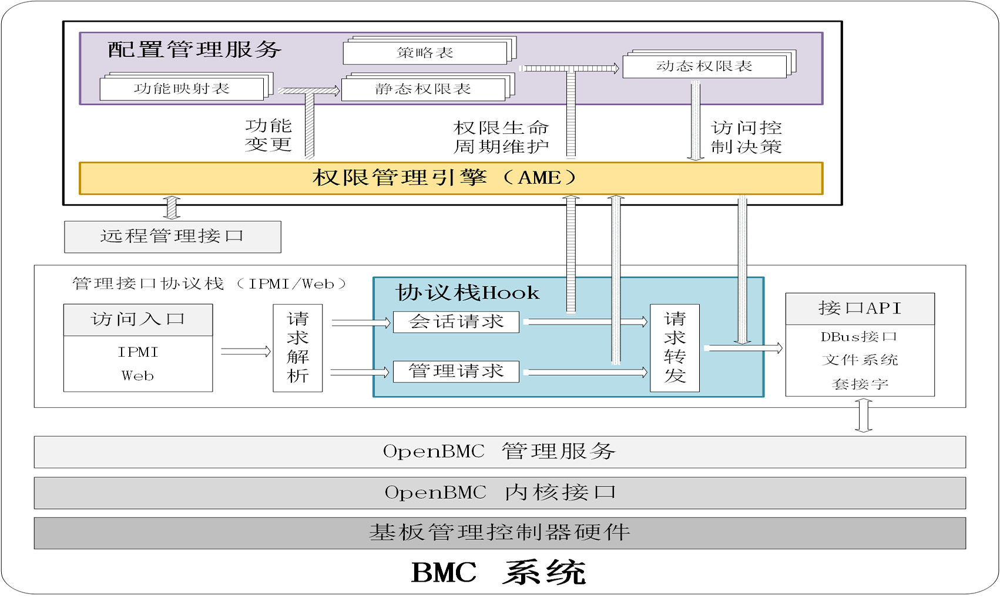
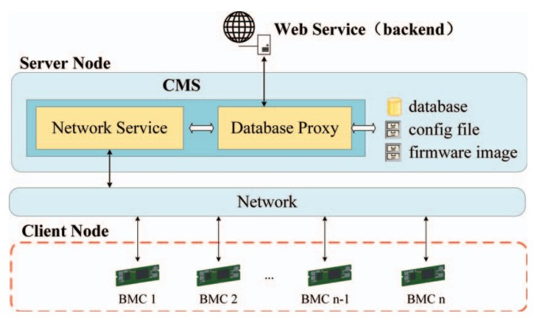
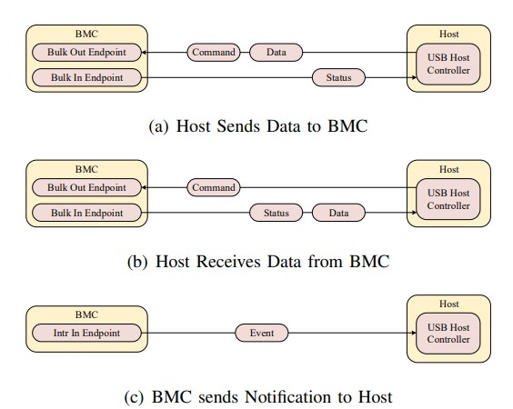
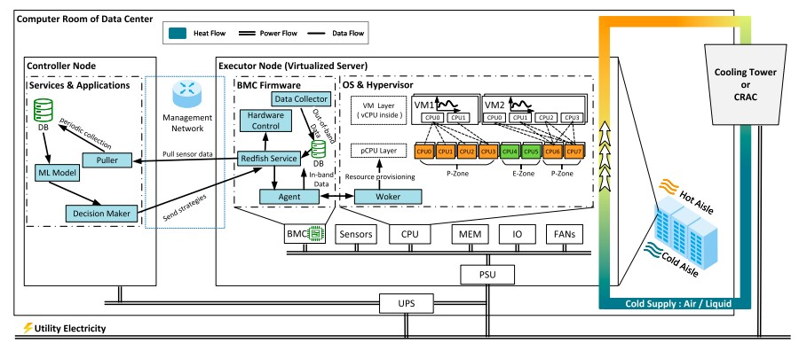
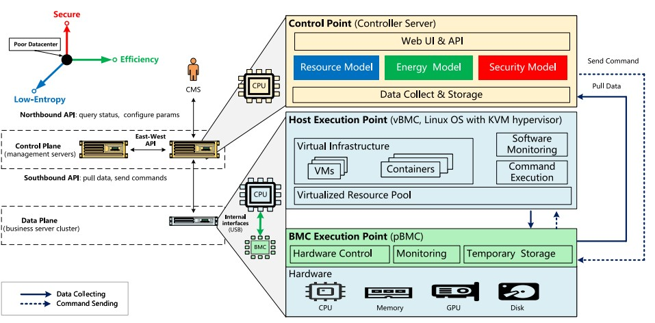
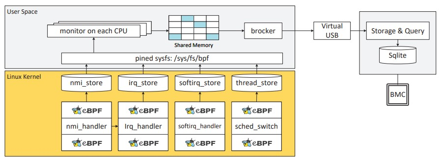

# HyperBMC

[中文](README.md) | [English](README_en.md)

以BMC为核心的软件定义平台管理方案，赋能数据中心高效与安全运营

## 概述

**HyperBMC** 开创了数据中心管理的变革性范式，将**基板管理控制器（BMC）** 定位为核心智能枢纽。我们的解决方案重新定义了现代数据中心如何实现规模化的安全保障、运营效率与智能管理。

前缀“**Hyper**”寓意着突破传统边界的雄心——超越常规管理模式、超越标准安全实践、超越现有效率指标。借助HyperBMC，我们正构建下一代管理平面，为数据中心运营带来前所未有的自动化水平、可信性与可持续性。

## 什么是BMC？

**基板管理控制器（BMC）** 是嵌入服务器主板的专用微控制器，提供独立于主系统的管理子系统。它与主CPU和操作系统分离运行，支持**带外（OOB）** 控制与监控——确保管理员即便在服务器关机或无响应状态下，仍能执行管理操作。

## HyperBMC 愿景：超越一切

HyperBMC 通过将传统BMC的能力扩展为跨物理与虚拟基础设施的软件定义智能控制层，重新定义了平台管理的边界。

### 软件定义的平台管理

HyperBMC 引入软件定义控制理念，实现数据中心生态系统的统一管理——涵盖硬件、固件、虚拟化及应用层。

### 零信任安全架构

HyperBMC 通过轻量级动态权限控制与认证加密通信通道，构建全新的安全计算基础，实现真正的零信任管理模式。

### 高效低碳运营

利用热弹性感知调度与碳效率导向的资源分配算法，HyperBMC 不仅优化单台服务器性能，更实现数据中心整体能耗效率的提升。

### 突破现有架构局限

HyperBMC 将BMC从单纯的管理控制器转变为协调枢纽，打通硬件、虚拟化与云原生环境的管理壁垒——将传统物理基础设施管理能力延伸至虚拟基础设施领域。

借助HyperBMC，我们不仅是在管理服务器——更是在定义自主化、安全化、可持续化数据中心运营的未来。

## 相关成果

#### [1] 刘宏伟, 夏豪骏, 涂碧波, 等. 基板管理控制器轻量级动态权限控制机制研究[J]. 信息安全学报, 2022.



针对BMC存在的权限过度分配与滥用安全风险，本文提出适用于资源受限BMC的轻量级动态权限控制框架。其核心在于将跨协议权限统一为细粒度描述符，通过动态引擎实现权限的实时管理与审计，并采用轻量级机制降低性能开销。实验表明，该方案在确保安全性的同时，性能影响极小，适用于嵌入式BMC部署场景。

```bibtex
@article{liu2022bmcen,
  author = {刘宏伟 and 夏豪骏 and 涂碧波 and 王晓彤},
  title = {基板管理控制器轻量级动态权限管控机制研究},
  journal = {信息安全学报},
  year = {2024},
  doi = {10.19363/J.cnki.cn10-1380/tn.2024.02.10}
}
```

#### [2] Liu H W, Xia H J, Tu B. Secure and efficient BMC-based centralized management method for large-scale data centers[C]//2022 IEEE 24th International Conference on High Performance Computing & Communications (HPCC). IEEE, 2022: 1328-1335.



针对大规模数据中心传统分布式管理效率低下、运维成本高昂的问题，本文提出一种基于BMC的安全高效集中式管理方法。通过加密链路实现BMC统一接入与数据安全传输，并采用轻量级压缩与批处理机制提升管理效率。实验验证，在千级服务器场景下，命令延迟降低35%，且无安全漏洞。

```bibtex
@inproceedings{liu2022secure,
  title={Secure and efficient BMC-based centralized management method for large-scale data centers},
  author={Liu, Hongwei and Xia, Haojun and Tu, Bibo},
  booktitle={2022 IEEE 24th Int Conf on High Performance Computing \& Communications (HPCC)},
  pages={1328--1335},
  year={2022},
  organization={IEEE}
}
```

#### [3] Liu H W, Xia H J, Tu B, et al. A secure and efficient USB-based in-band communication interface between host and BMC[C]//IEEE International Conference on Parallel & Distributed Processing with Applications (ISPA). IEEE, 2022.



为解决现有主机与BMC通信接口的兼容性、安全性与效率问题，本文提出一种基于USB的带内通信方案。通过定制USB协议提升传输速率，引入端到端加密与双向认证保障安全，且无需额外硬件支持主流服务器架构。实验表明，该方案传输速率提升40%，加密开销低于5%。

```bibtex
@inproceedings{liu2022usb,
  author = {Hongwei Liu and Haojun Xia and Bibo Tu and Da Zhang and Xiaotong Wang},
  title = {A Secure and Efficient USB-based In-band Communication Interface between Host and BMC},
  booktitle = {IEEE Intl Conf on Parallel & Distributed Processing with Applications (ISPA)},
  year = {2022}
}
```

#### [4] Zhang D, Xia H J, Wang X T, et al. Thermal elasticity-aware host resource provision for carbon efficiency on virtualized servers[J]. IEEE Transactions on Computers, 2025, 74(11): 3682-3695.



资源分配过程中忽略服务器热弹性特性，制约了数据中心碳效率的提升。本文提出一种热弹性感知的主机资源调度方法，通过建立热弹性模型与动态调度算法，结合负载、温度与碳强度优化资源分配。实验表明，该方法在保障服务质量（QoS）的前提下，碳排放量降低28%-35%，能源效率提升22%。

```bibtex
@article{zhang2025thermal,
  author = {Da Zhang and Haojun Xia and Xiaotong Wang and Yanchang Feng and Bibo Tu},
  title = {Thermal Elasticity-Aware Host Resource Provision for Carbon Efficiency on Virtualized Servers},
  journal = {IEEE Transactions on Computers},
  year = {2025},
  volume = {74},
  number = {11},
  pages = {3682-3695}
}
```

#### [5] Zhang D, Xia H J, Wang X T, et al. Software-defined platform management for data center: Security, low entropy, and efficiency[J]. Cybersecurity, 2025, (Accepted).



针对传统数据中心管理架构僵化、安全性不足、调度熵值高的问题，本文提出一种软件定义的平台管理架构。通过解耦管理逻辑与硬件依赖，整合零信任安全、熵值优化与微服务设计，为下一代数据中心管理提供新思路。该成果已被《Cybersecurity》期刊接收。

```bibtex
@article{zhang2025sdpm,
  author = {Da Zhang and Haojun Xia and Xiaotong Wang and Bibo Tu},
  title = {Software-Defined Platform Management for Data Center: Security, Low Entropy, and Efficiency},
  journal = {Cybersecurity},
  year = {2025},
  doi = {10.1186/s42400-025-00410-4}
}
```

#### [6] Zhang D, Xia H J, Wang X T, et al. Interference monitoring for colocated workloads in low-entropy computing systems[C]//28th International Conference on Computer Supported Cooperative Work in Design (CSCWD 2025). 2025.



低熵计算系统中工作负载混部会导致资源干扰，进而降低服务质量（QoS）。本文提出一种干扰监测方法，通过轻量级代理收集关键指标，利用机器学习实现干扰识别，并采用自适应策略平衡检测精度与系统开销。该成果将在2025年第28届计算机支持的协同工作设计国际会议（CSCWD 2025）发布，干扰识别准确率超过92%，系统开销低于3%。

```bibtex
@inproceedings{zhang2025interference,
  author = {Da Zhang and Haojun Xia and Xiaotong Wang and Yanchang Feng and Bibo Tu},
  title = {Interference Monitoring for Colocated Workloads in Low-Entropy Computing Systems},
  booktitle = {28th International Conference on Computer Supported Cooperative Work in Design (CSCWD 2025)},
  year = {2025}
}
```